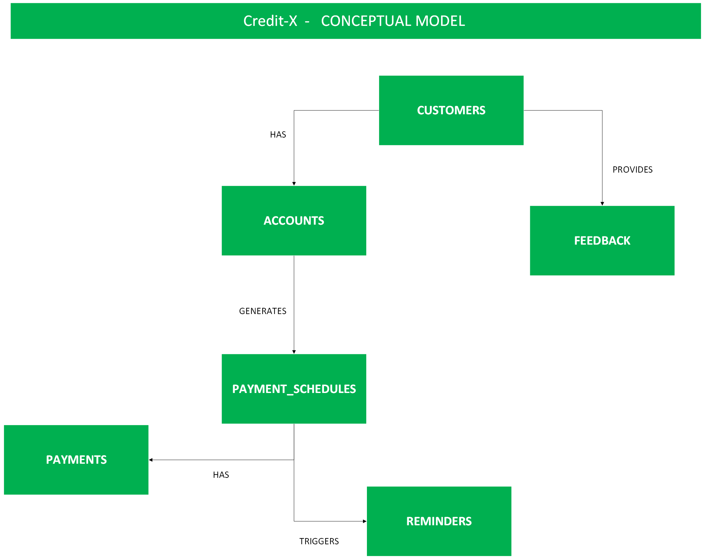

# Credit-X Payment Reminder Optimization  
**Redesigning the Reminder Strategy to Improve Customer Experience and Reduce Delinquency**

---

Credit-X is facing **customer dissatisfaction** due to its **ineffective payment reminder system**. Feedback highlights several pain points:
- Inconsistent reminder frequency (some months have none, others have too many)
- Poor timing of messages across the year
- No customization or personalization options

These issues have contributed to **~10% monthly delinquency rates**, causing unnecessary interest charges and lowering customer satisfaction.

---

##  Goal

Redesign the payment reminder communication strategy using data-driven insights, with the following objectives:
- Improve the effectiveness of reminders
- Reduce the delinquency rate
- Enhance the customer experience

---

##  Conceptual Model

To understand the ecosystem, we structured the system relationships conceptually as follows:

---

##  Synthetic Data Generation

To support robust analysis and experimentation, the dataset was synthetically generated using statistical distributions and economic principles that mirror real-world financial behavior. Each table in the dataset was designed to reflect realistic variability, customer behavior patterns, and macroeconomic trends over time.

### Key Design Principles:

- **Customer Risk Tiers** were assigned using the Pareto principle: most customers fall into the low-risk segment, while a smaller group accounts for most delinquencies. This simulates the structure of real financial portfolios.

- **Credit Scores** were generated based on the customer’s risk tier, following normal distributions with different means and standard deviations. This reflects how actual credit scores cluster by financial health.

- **Credit Limits** follow a heavy-tailed Pareto distribution, where a small portion of customers hold disproportionately high credit limits—common in credit card and lending products.

- **Delinquency Probability** increases each year to simulate economic downturns. A logistic-like scaling was applied depending on customer risk tier and the year, representing how financial pressure accumulates over time.

- **Days Late** for payments follow a Weibull distribution, commonly used in failure-time modeling. This captures the fact that most payments are only slightly late, but some are delayed significantly.

- **Reminder Engagement** follows an exponential decay model. The probability of engaging (e.g., opening a message) decreases with each additional reminder, but improves slightly year-over-year due to better technology and communication strategies.

- **Seasonal Payment Amounts** were adjusted using a sinusoidal function to reflect holiday-driven spending behavior—peaking in December and dipping early in the year.

- **Partial Payments** were modeled using a beta distribution to reflect the fact that customers are more likely to make underpayments than overpayments, while staying within realistic bounds.

---

### Summary of Real-World Mapping

| **Aspect**               | **Statistical Behavior**               | **Real-World Justification**                                 |
|--------------------------|----------------------------------------|---------------------------------------------------------------|
| Customer segmentation    | Discrete distribution (Pareto rule)    | Few high-risk customers drive majority of delinquencies       |
| Credit capacity          | Power-law distribution                 | Wealth and credit inequality                                  |
| Creditworthiness         | Gaussian distribution per risk tier    | Credit scores cluster predictably by risk                     |
| Payment behavior         | Weibull and logistic scaling           | Payment delays and delinquency escalate under stress          |
| Engagement with reminders| Exponential decay with tech gain       | Drop-off in user response, improved by better systems         |
| Seasonality              | Trigonometric cycles                   | Spending peaks during holidays                                |
| Underpayment behavior    | Beta distribution                      | Payment ratios are bounded and often skewed toward lower end  |

---

##  Analytical Framework

We structured the analysis by mapping key metrics from each table to their roles in the business question.

| **Table**     | **Key Metrics**                             | **Use in Analysis**                           |
|--------------|----------------------------------------------|------------------------------------------------|
| `reminders`  | `opened`, `clicked`, `payment_triggered`     | Channel effectiveness & customer engagement    |
| `payments`   | `days_late`, `amount_paid`                   | Customer payment behavior & delinquency trends |
| `customers`  | `risk_tier`, `income_bracket`                | Customer segmentation & targeting              |
| `schedules`  | `due_date`, `amount_due`                     | Reminder coverage & payment scheduling         |

---
---

## Project Structure

###  `data/raw/`
Contains all the generated CSV datasets used for modeling and analysis:
- `customers.csv`, `accounts.csv`, `payment_schedules.csv`, `payments.csv`, `reminders.csv`, `feedback.csv`
- These files are **generated automatically** by the script:  
  `generate_data.py`

### 📁 `notebooks/`
Houses the complete analytical process in Jupyter notebooks (and compiled HTML reports):

1. **`01_EDA.ipynb`** – *Exploratory Data Analysis*  
   Initial descriptive statistics, distributions, outliers, and behavioral patterns in the raw data.

2. **`02_CSAPandPF.ipynb`** – *Current State Analysis Plan & Problem Formulation*  
   - Identifies current system failures and pain points  
   - Defines business goals and key metrics  
   - Frames the problem in data science terms

3. **`03_SD.ipynb`** – *Solution Design*  
   Proposes and simulates improved reminder strategies, evaluates impact, and guides business implementation.

###  Other Key Files

- `Drawing.png` – Conceptual data model used to design the schema
- `.gitignore`, `pyproject.toml`, `.python-version` – Environment and dependency management
- `README.md` – Project documentation and roadmap

### Conversation history with AI assistants used during solution development
  https://chatgpt.com/share/6862d0b8-5d5c-800a-a077-7eb08716a832
